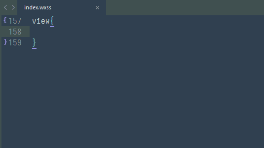

px2rpx
-------------

一个用于在开发小程序时px值转rpx值的sublime text自动完成插件。rpx的知识请参考 [这里](https://mp.weixin.qq.com/debug/wxadoc/dev/framework/view/wxss.html)




## 安装

1. 下载本项目, git clone https://github.com/wweggplant/px2rpx.git
2. 进入packages目录：Sublime Text -> Preferences -> Browse Packages....
3. 复制下载的px2rpx目录到刚才的packges目录里。
4. 重启Sublime Text。

## 配置

配置文件: Sublime Text -> Preferences -> Package Settings -> px2rpx


* `devices` - 设备信息列表

```json
"devices": 
[
    {
        "name" :"iphone4/5", //设备名称
        "info":{
            "width": 320 //设备宽度
        }
    }...
]
```

>ps：User中的px2rpx.sublime-settings文件由于会覆盖默认配置文件px2rpx.sublime-setting中的数组项目，所以吧几个常见的设备信息硬编码在程序中。

* `max_rpx_fraction_length` - 小数部分的最大长度。默认为2。
* `rpx_standard_length` - rpx官方规定屏幕宽
* `available_file_types` - 启用此插件的文件类型,默认`.wxss`

>代码参考了 [https://github.com/flashlizi/cssrem](https://github.com/flashlizi/cssrem)。在此感谢原作者。
